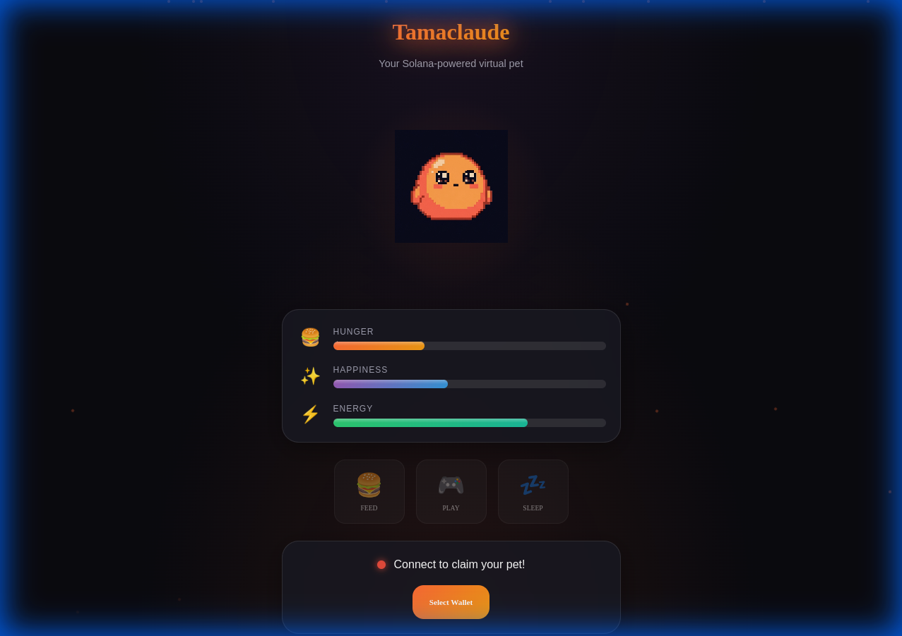
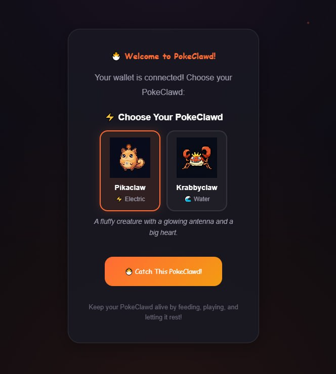

# ⚡ PokeClawd


**Open Claw Powered Pets** — A virtual pet game with Solana wallet integration.



## ✨ Features

| Feature | Description |
|---------|-------------|
| ⚡ **PokeClawd Pet** | Cute claw-powered creature with custom sprites |
| 🎬 **Action Sprites** | Unique art for feeding, playing & sleeping |
| 📊 **Pet Stats** | Hunger, Happiness, Energy — decay in real-time |
| ⏱️ **5-Min Cooldowns** | Strategic action timing |
| 💀 **Death System** | When any stat hits 0, your PokeClawd faints |
| 📴 **Offline Death** | Stats keep decaying while you're away |
| 🏆 **Scoring** | 1 pt/sec alive + 100 pts/action |
| 👛 **Wallet-Only** | Must connect Phantom/Solflare to play |
| 🗃️ **MongoDB Storage** | Scores & history saved per wallet |
| 📜 **Pet History** | View all your past PokClawds |
| 📋 **Leaderboard** | Global high scores |

## 🚀 Quick Start

```bash
# Clone & install
git clone https://github.com/sp3aker2020/Tamaclaude.git
cd Tamaclaude && npm install

# Set up environment
cp .env.example .env
# Edit .env with your MongoDB Atlas connection string

# Run (2 terminals)
npm run dev      # Frontend on :5173
npm run server   # API on :3001
```

## 🎮 How to Play

### 1. New: Choose Your Pet! 🐾
When you first connect, you can now choose your PokeClawd!
- **Pikaclaw** (⚡ Electric): Fluffy and energetic
- **Krabbyclaw** (🌊 Water): Feisty and protective


*(Please add your screenshot as `screenshot-selection.png`)*

### 2. Connect Your Wallet
Click the "Select Wallet" button to start. This retrieves your pet's history.

### 3. Care for Your PokeClawd:
   - 🍔 **Feed** → +25 Hunger
   - 🎮 **Play** → +20 Happiness, -15 Energy  
   - 💤 **Sleep** → +30 Energy


*(Please add your screenshot as `screenshot2.png`)*

### 4. Don't Let Stats Hit Zero — Or your PokeClawd faints!
5. **Check Your History** — See all past PokeClawds on claim screen

## 🏗️ Tech Stack

| Layer | Tech |
|-------|------|
| Frontend | React + Vite |
| Styling | CSS with glassmorphism |
| Wallet | @solana/wallet-adapter |
| Backend | Express.js |
| Database | MongoDB Atlas |
| Deploy | Render |

## 📁 Structure

```
├── src/
│   ├── api/client.js        # API calls
│   ├── components/          # Pet, Stats, GameOver, etc.
│   ├── hooks/usePetState.js # Game logic + offline death
│   └── assets/              # PokeClawd sprites
├── server/
│   ├── models/PetHistory.js
│   ├── routes/scores.js
│   └── index.js
├── render.yaml              # Render deployment
└── .env.example
```

## 🌐 API

| Method | Endpoint | Description |
|--------|----------|-------------|
| GET | `/health` | Health check |
| POST | `/api/scores` | Save score |
| GET | `/api/scores/:wallet` | Wallet history |
| GET | `/api/scores/leaderboard/top` | Top 10 |

## 🚢 Deploy to Render

1. Push to GitHub
2. Render → New → **Web Service** (API) + **Static Site** (Frontend)
3. Set env vars:
   - API: `MONGODB_URI`
   - Frontend: `VITE_API_URL`

## 📝 License

MIT

---

⚡ Open Claw Powered Pets
